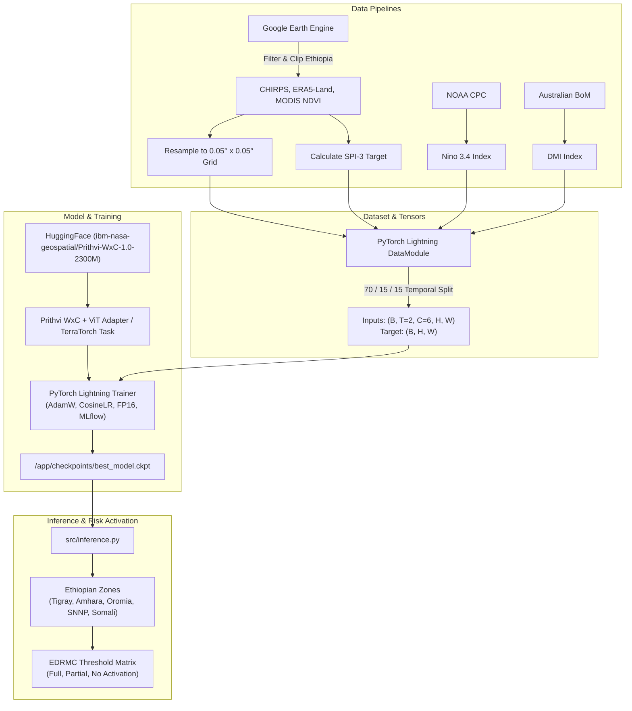

# Production-Ready Prithvi WxC Drought Prediction Pipeline for Ethiopia

This implementation plan outlines the architecture, data processing, model fine-tuning, and inference pipelines for predicting SPI-3 drought indices over Ethiopia using IBM/NASA's Prithvi WxC foundation model (2.3B parameters).

## Architecture & Workflow Overview

---

## User Review Required

> [!IMPORTANT]
> **Spatial Clipping Assertion**: All GEE raster processing strictly enforces bounds clipping to Ethiopia `ee.FeatureCollection('FAO/GAUL/2015/level0').filter(ee.Filter.eq('ADM0_NAME', 'Ethiopia')).geometry()` with fallback to bbox `[33.0, 3.0, 48.0, 15.0]`. An assertion is embedded to confirm all exported grids remain within the Ethiopian national boundary.

> [!NOTE]
> **GEE Authentication**: Earth Engine authentication relies on a mounted service account key file path set via `GEE_SERVICE_ACCOUNT_KEY`. If unauthenticated or running mock testing, fallback/offline simulation mechanisms are provided.

---

## Proposed Changes

### Configuration & Infrastructure

#### [NEW] [Dockerfile](file:///c:/Users/HP/Desktop/Project/EWS/Dockerfile)
- Base Image: `pytorch/pytorch:2.2.0-cuda12.1-cudnn8-runtime`
- System Dependencies: GDAL (`gdal-bin`, `libgdal-dev`), `curl`, `git`, `wget`, `zip`, `build-essential`.
- Environment setup for GDAL headers and Python dependencies.

#### [NEW] [docker-compose.yml](file:///c:/Users/HP/Desktop/Project/EWS/docker-compose.yml)
- Services definition (`drought-pipeline`).
- Volume mounts:
  - `./data` → `/app/data`
  - `./credentials` → `/app/credentials`
  - `./mlruns` → `/app/mlruns`
  - `./checkpoints` → `/app/checkpoints`
- GPU capability reservation.
- Build & Run documentation comments (`docker compose build`, `docker compose up`).

#### [NEW] [requirements.txt](file:///c:/Users/HP/Desktop/Project/EWS/requirements.txt)
- `terratorch`, `torchgeo`, `earthengine-api`, `geemap`, `geedim`, `xarray`, `rioxarray`, `netcdf4`, `huggingface_hub`, `mlflow`, `pytorch-lightning`, `scikit-learn`, `pandas`, `dask`, `scipy`.

#### [NEW] [.env.example](file:///c:/Users/HP/Desktop/Project/EWS/.env.example)
- Default environment configuration template.

---

### Python Pipeline (`src/`)

#### [NEW] [config.py](file:///c:/Users/HP/Desktop/Project/EWS/src/config.py)
- AOI configuration: `ADM0_NAME == 'Ethiopia'`, fallback bounding box `[33.0, 3.0, 48.0, 15.0]`.
- Spatial Grid: 0.05° × 0.05° resolution (~5.5 km).
- Spatial boundary validation assertion helper (`check_ethiopia_bounds`).
- Model & Training Hyperparameters (AdamW, LR=1e-4, CosineAnnealingLR, MSE loss, Batch size=8, FP16 precision, Max Epochs=50, Early stopping patience=10).
- Climate Index URLs (NOAA CPC Nino 3.4, BoM IOD DMI).
- EDRMC zone definitions & activation threshold rules.

#### [NEW] [data_pipeline.py](file:///c:/Users/HP/Desktop/Project/EWS/src/data_pipeline.py)
- GEE initialization with Service Account Key.
- Earth Engine raster downloading & clipping for Ethiopia AOI:
  - CHIRPS daily precipitation aggregated to monthly sums.
  - ERA5-Land daily 2m temperature aggregated to monthly means (converted K → °C).
  - ERA5-Land volumetric soil moisture (layer 1) aggregated to monthly means.
  - MODIS MOD13Q1 16-day NDVI scaled by 0.0001 aggregated to monthly means.
- SPI-3 computation function (3-month rolling precipitation fitted to Gamma distribution per pixel).
- ENSO (Nino 3.4) and IOD (DMI) live index fetching and month alignment.
- Spatial resampling to 0.05° grid and NetCDF/Zarr save.
- Ethiopia spatial bounding assertion check.

#### [NEW] [dataset.py](file:///c:/Users/HP/Desktop/Project/EWS/src/dataset.py)
- `EthiopiaDroughtDataset` (PyTorch Dataset):
  - Formats 2 preceding months ($t-2, t-1$) into tensor shape `(batch, time_steps=2, channels=6, H, W)`.
  - Replicates scalar ENSO & IOD values across spatial grid dimensions ($H \times W$).
  - Target SPI-3 tensor shape `(batch, H, W)`.
- `EthiopiaDroughtDataModule` (PyTorch Lightning DataModule):
  - Temporally stratified 70% train / 15% val / 15% test splitting.
  - Efficient DataLoader construction.

#### [NEW] [model.py](file:///c:/Users/HP/Desktop/Project/EWS/src/model.py)
- `PrithviWxCForDrought` module loading `ibm-nasa-geospatial/Prithvi-WxC-1.0-2300M` backbone with ViT Adapter / TerraTorch integration.
- Channel adapter mapping 6 input channels (4 spatial + 2 climate scalars) to model input space and outputting 1 channel (SPI-3 map).
- `PixelWiseRegressionTask` wrapper using PyTorch Lightning.

#### [NEW] [train.py](file:///c:/Users/HP/Desktop/Project/EWS/src/train.py)
- Lightning Trainer execution.
- MLflow logger initialization.
- ModelCheckpoint and EarlyStopping callbacks.
- Metrics evaluation (RMSE, $R^2$) logged per epoch.

#### [NEW] [inference.py](file:///c:/Users/HP/Desktop/Project/EWS/src/inference.py)
- Checkpoint loading from `/app/checkpoints/best_model.ckpt`.
- Prediction on test dataset over Ethiopian spatial extent.
- Zonal statistics computation per Ethiopian zone (Tigray, Amhara, Oromia, SNNP, Somali):
  - Probability of SPI-3 < -1.
  - Percentage of zone area with SPI-3 < -1.
- EDRMC activation matrix logic:
  - **FULL ACTIVATION**: Prob ≥ 45% AND Area > 50% AND Mean SPI-3 < -1
  - **PARTIAL ACTIVATION**: Prob ≥ 45% AND Area > 50% AND Mean SPI-3 ≥ -1
  - **NO ACTIVATION**: Otherwise
- Formatted tabular output per zone.

---

## Verification Plan

### Automated Tests & Code Verification
- Validate syntax, imports, and type safety across all Python scripts.
- Run spatial bounding box assertion test verifying Ethiopia extent limits: `33.0 <= min_lon < max_lon <= 48.0` and `3.0 <= min_lat < max_lat <= 15.0`.
- Verify tensor shapes produced by `EthiopiaDroughtDataset`:
  - Input shape: `(batch, 2, 6, H, W)`
  - Target shape: `(batch, H, W)`
- Validate docker compose configuration syntax.

### Manual Verification
- Test Docker image build capability and volume mount mapping.
- Execute synthetic / mock run of `train.py` and `inference.py` to ensure MLflow logging, checkpointing, and zonal status printing execute smoothly.
